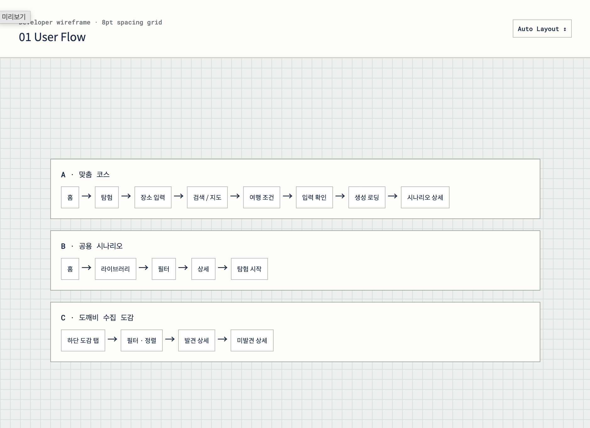
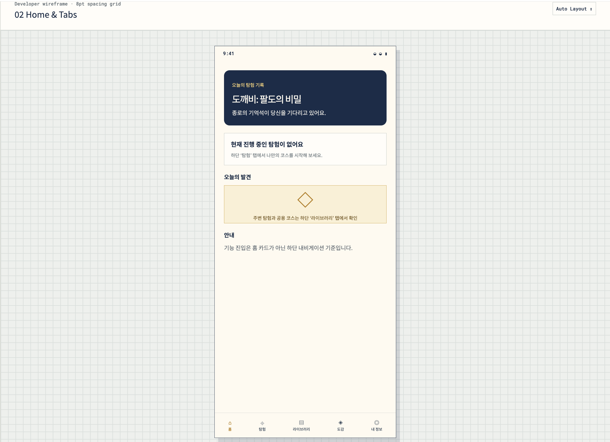
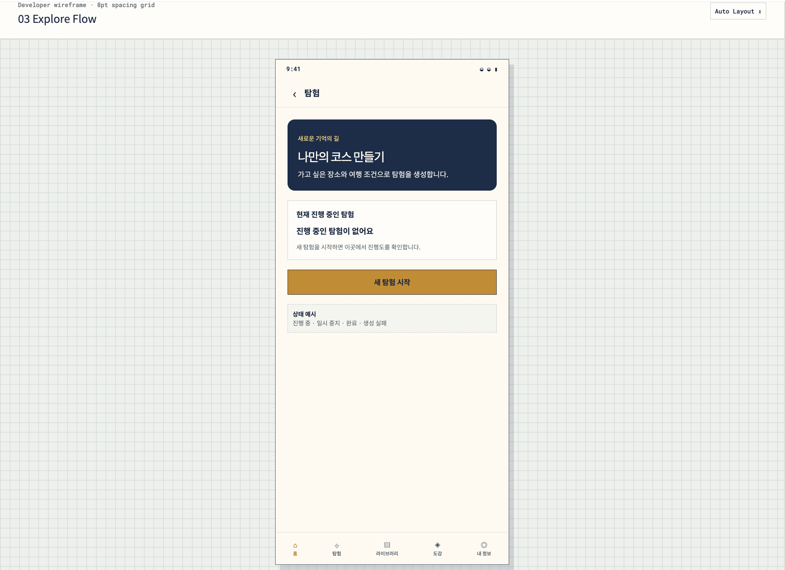
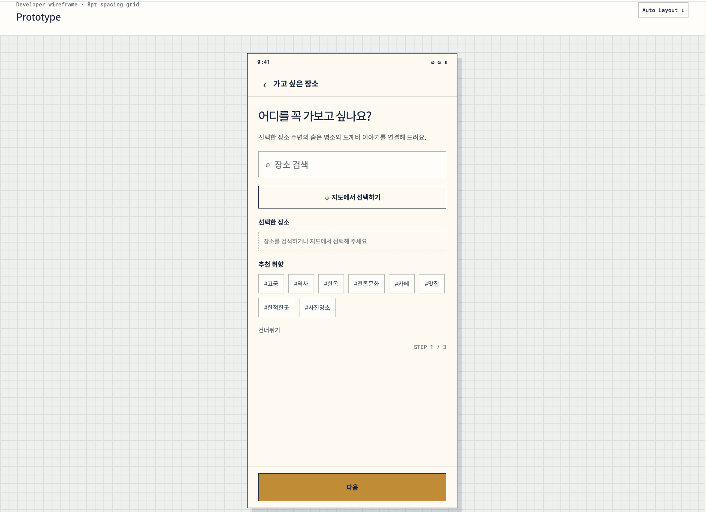
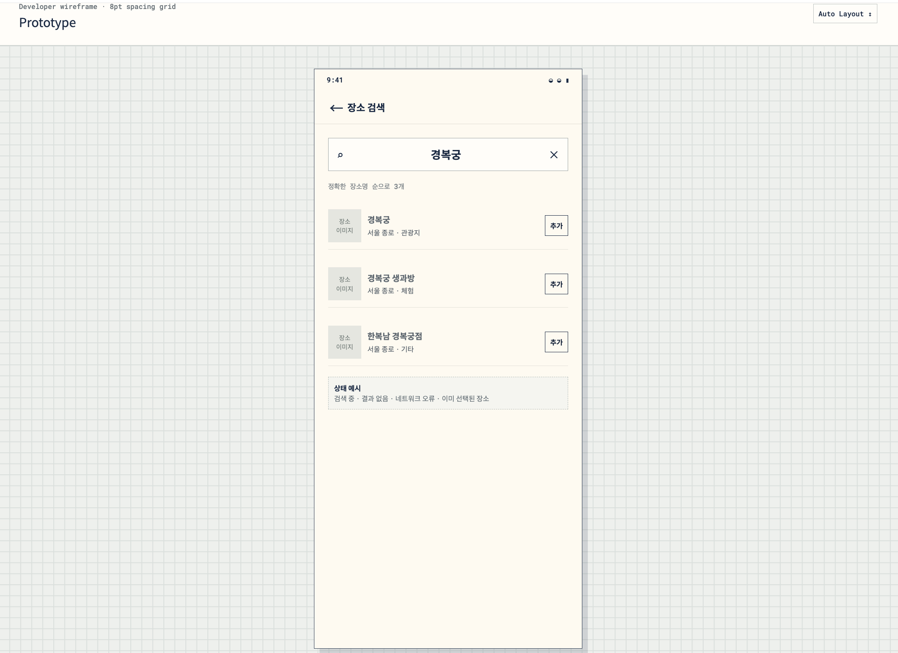
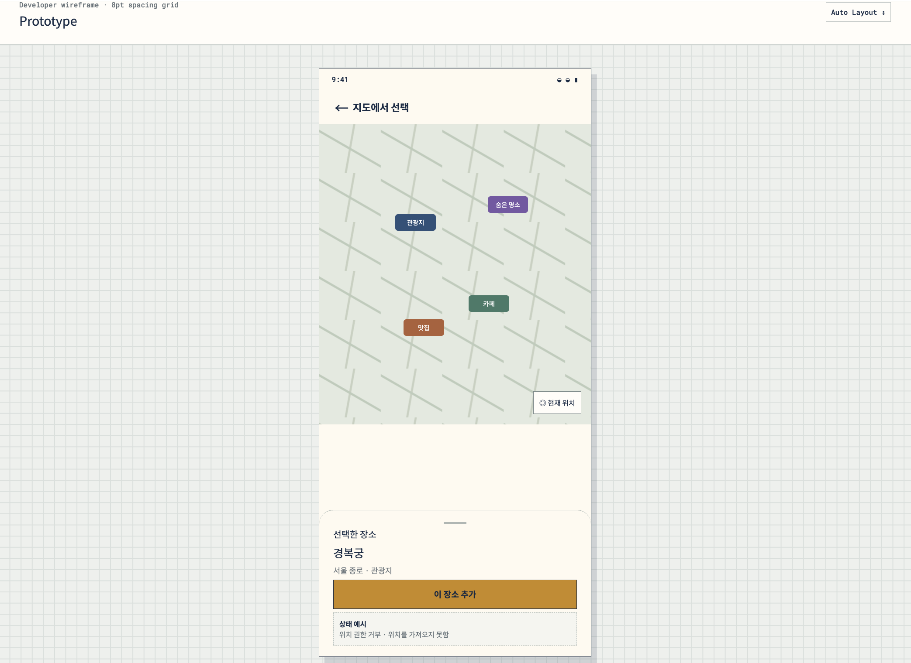
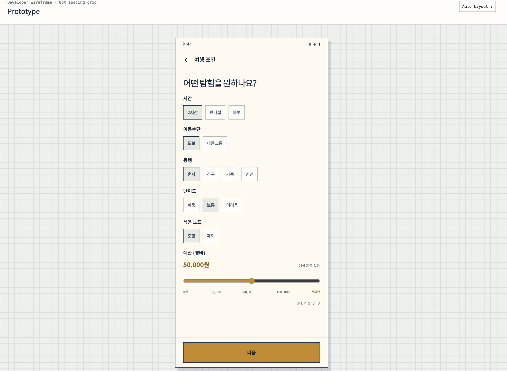
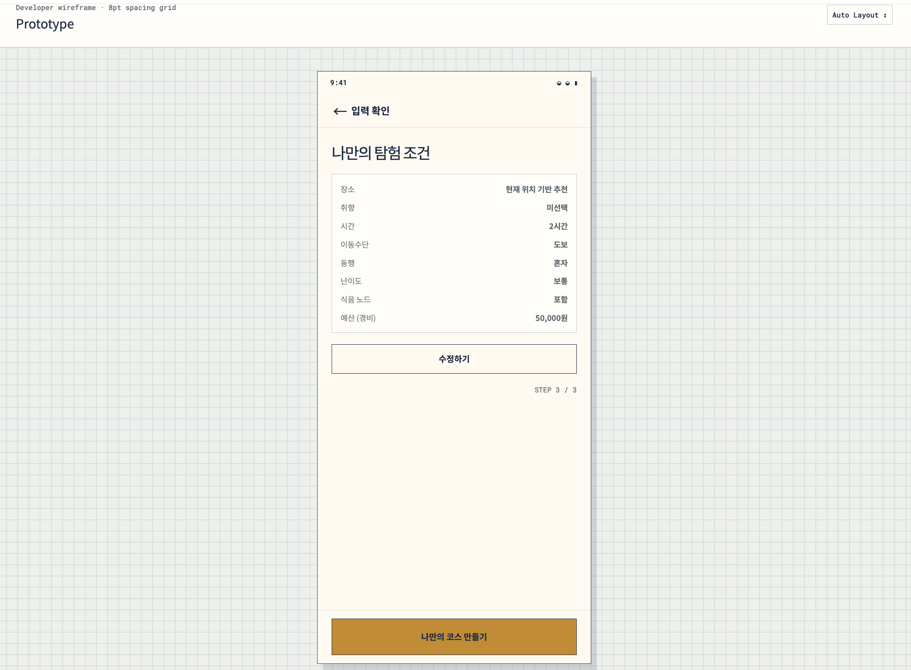
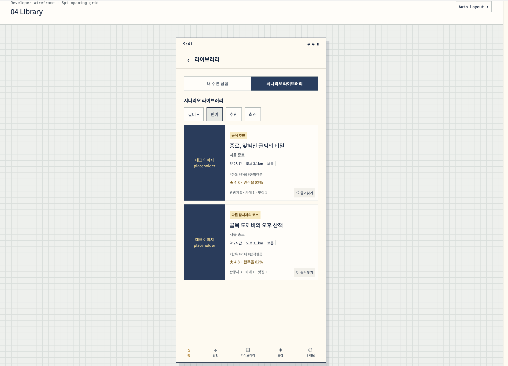
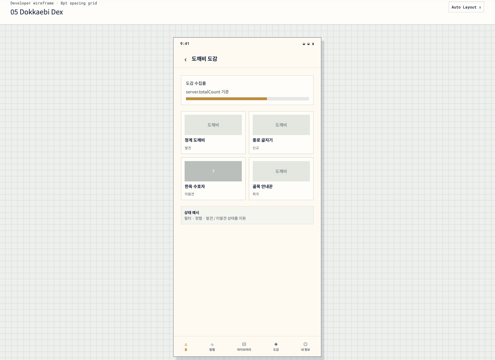

# M3 UI/UX 와이어프레임 및 개발 전달 명세

## 1. 개요

`도깨비: 팔도의 비밀` M3 기능 개발을 위한 UI/UX 와이어프레임과 개발 전달용 컴포넌트 명세입니다.

이번 작업은 Flutter 화면 구현 전 다음 내용을 팀원들과 공유하고 합의하기 위해 제작했습니다.

- 앱 정보 구조 및 하단 내비게이션
- 나만의 코스 만들기
- 위시리스트 기반 시나리오 생성
- 내 주변 탐험
- 시나리오 라이브러리
- 도깨비 수집 도감
- 쿠폰 카드 및 팝업 가이드
- 공통 UI 컴포넌트와 상태
- Flutter 개발용 모바일 화면 보드
- 로딩·빈 결과·오류 등 예외 상태

> 본 결과물은 최종 비주얼 디자인이 아니라, 화면 구조·동작·상태를 확인하기 위한 개발 전달용 와이어프레임입니다.

---

## 2. Figma 작업물

- [Figma Make 작업물 열기](https://www.figma.com/make/ZM2IugiUaIVep5wzt4Ajv0/Wireframe-for-Development_wishlist-senario-library-dex--%EB%B3%B5%EC%82%AC-?t=LMVfrwtQP65ZLMqq-1)

Figma Make에서 다음 페이지를 확인할 수 있습니다.

1. User Flow
2. Home & Tabs
3. Explore Flow
4. Scenario Library
5. Dokkaebi Dex
6. Coupon Guide
7. Components
8. Developer Screen Board
9. States and Empty Cases

---

## 3. 작업 범위

### 포함

- 홈·탐험·라이브러리·도감·내정보 하단 내비게이션
- 탐험 탭의 나만의 코스 만들기
- 장소 검색 및 지도 선택
- 여행 조건 및 예산 선택
- 시나리오 생성·상세 화면
- 내 주변 탐험
- 공용 시나리오 라이브러리
- 발견·미발견 도깨비 도감
- 쿠폰 카드·팝업 상태
- 공통 컴포넌트 명세
- 로딩·오류·빈 결과 등 상태 정의

### 제외

- Flutter 실제 구현
- API 및 데이터베이스 연동
- 실제 지도 SDK 연결
- AR 화면 구현
- 최종 도깨비 일러스트
- 실제 매장 제휴 및 결제 기능
- 칭호 기능

---

## 4. 정보 구조

앱의 주요 기능은 하단 내비게이션으로 진입합니다.

| 탭 | 주요 기능 |
|---|---|
| 홈 | 오늘의 탐험 상태와 서비스 안내 |
| 탐험 | 진행 중인 탐험 확인 및 나만의 코스 만들기 |
| 라이브러리 | 내 주변 탐험 및 공용 시나리오 확인 |
| 도감 | 발견·미발견 도깨비 수집 현황 |
| 내정보 | 사용자 프로필 및 보유 쿠폰 확인 |

기존 홈 화면에 있던 기능 진입 카드 네 개는 제거했습니다.

기능별 진입 위치는 다음과 같습니다.

- 나만의 코스 만들기 → `탐험`
- 내 주변 탐험 → `라이브러리`
- 시나리오 라이브러리 → `라이브러리`
- 도깨비 도감 → `도감`
- 보유 쿠폰 → `내정보`

---

## 5. 전체 사용자 흐름

### 나만의 코스 만들기

탐험 탭  
→ 새 탐험 시작  
→ 가고 싶은 장소 입력  
→ 장소 검색 또는 지도 선택  
→ 취향 태그 선택  
→ 여행 조건 및 예산 선택  
→ 입력 내용 확인  
→ 시나리오 생성  
→ 시나리오 상세  
→ 탐험 시작  
→ 기존 지도·퀘스트 플레이 화면

### 라이브러리

라이브러리 탭  
→ 내 주변 탐험 또는 시나리오 라이브러리 선택  
→ 필터 및 정렬  
→ 시나리오 카드 선택  
→ 시나리오 상세  
→ 탐험 시작

### 도깨비 도감

도감 탭  
→ 도깨비 목록  
→ 발견 또는 미발견 도깨비 선택  
→ 도깨비 상세  
→ 관련 코스 확인

---

## 6. 홈 및 하단 내비게이션

하단 내비게이션은 다음 다섯 개 탭으로 구성합니다.

- 홈
- 탐험
- 라이브러리
- 도감
- 내정보

홈에서는 별도의 기능 진입 카드를 제공하지 않습니다.

홈 화면에는 다음 정보만 간단히 표시합니다.

- 현재 진행 중인 탐험
- 오늘의 발견
- 주변 탐험과 공용 코스 이용 안내
- 탐험 탭에서 나만의 코스를 만들 수 있다는 안내

### 하단 내비게이션 표시 화면

- 홈 메인
- 탐험 메인
- 라이브러리 메인
- 도감 메인
- 내정보 메인

### 하단 내비게이션 숨김 화면

- 위시리스트 입력
- 장소 검색
- 지도 선택
- 여행 조건
- 입력 확인
- 생성 로딩
- 시나리오 상세
- 도깨비 상세

깊은 화면에서는 뒤로가기 버튼과 하단 고정 CTA를 사용합니다.

---

## 7. 탐험 탭

탐험 탭에서는 현재 진행 중인 탐험을 확인하거나 새로운 맞춤 코스를 생성합니다.

### 탐험 메인

표시 정보:

- 현재 진행 중인 탐험
- 탐험 진행도
- 탐험 상태
- 새 탐험 시작 버튼

진행 중인 탐험이 없을 때는 빈 상태 안내와 `새 탐험 시작` 버튼을 표시합니다.

지원 상태:

- 진행 중
- 일시 중지
- 완료
- 생성 실패
- 진행 중인 탐험 없음

---

## 8. 위시리스트 입력

사용자는 다음 방법으로 가고 싶은 장소와 취향을 입력합니다.

- 장소명 검색
- 지도에서 선택
- 취향 태그 선택
- 장소 입력 건너뛰기

취향 태그 예시:

- 고궁
- 역사
- 한옥
- 전통문화
- 카페
- 맛집
- 한적한 곳
- 사진 명소

선택한 장소는 칩 형태로 표시하며 `×` 버튼으로 삭제할 수 있습니다.

### 건너뛰기

장소 입력을 건너뛰면 확인 팝업을 표시합니다.

> 현재 위치와 여행 조건을 기반으로 시스템 추천 코스를 만들어요.

위시리스트 최대 선택 개수는 UI에 고정하지 않고 서버 정책을 따릅니다.

---

## 9. 장소 검색

검색 결과에는 다음 정보를 표시합니다.

- 장소 이미지
- 장소명
- 지역
- 장소 유형
- 추가 버튼

예시:

- 경복궁 / 서울 종로 / 관광지
- 경복궁 생과방 / 서울 종로 / 체험
- 한복남 경복궁점 / 서울 종로 / 기타

지원 상태:

- 검색 중
- 검색 결과 없음
- 네트워크 오류
- 이미 선택된 장소
- 검색 결과 정상 노출

---

## 10. 지도 선택

지도에서는 다음 장소 유형을 선택할 수 있습니다.

- 관광지
- 숨은 명소
- 맛집
- 카페

### 장소 유형 구분

장소 유형별로 서로 다른 모양의 아이콘을 사용하지 않습니다.

모든 마커와 필터 버튼은 동일한 형태를 사용하고, 유형별 색상과 텍스트 라벨로 구분합니다.

| 장소 유형 | 표현 방식 |
|---|---|
| 관광지 | 관광지 색상 + 텍스트 라벨 |
| 숨은 명소 | 숨은 명소 색상 + 텍스트 라벨 |
| 맛집 | 맛집 색상 + 텍스트 라벨 |
| 카페 | 카페 색상 + 텍스트 라벨 |

색상만으로 구분하지 않도록 텍스트를 함께 제공합니다.

### 지도 동작

- 현재 위치로 이동
- 장소 유형 필터 선택
- 지도 마커 선택
- 장소 정보 바텀시트 표시
- `이 장소 추가` 버튼으로 위시리스트에 추가

지원 상태:

- 장소 선택 전
- 장소 선택 완료
- 위치 권한 거부
- 위치 조회 실패

식음 노드에 대한 별도 UI 가이드는 제공하지 않습니다. 맛집과 카페는 지도와 시나리오 안에서 장소 유형으로 처리합니다.

---

## 11. 여행 조건 및 예산

각 여행 조건은 서로 독립적으로 선택합니다.

### 시간

- 2시간
- 반나절
- 하루

### 이동수단

- 도보
- 대중교통

### 동행

- 혼자
- 친구
- 가족
- 연인

### 난이도

- 쉬움
- 보통
- 어려움

### 식음 노드

- 포함
- 제외

### 예산

예상 경비 상한을 슬라이더로 선택합니다.

- 0원
- 10,000원 단위
- 최대 100,000원
- 무제한

예산 값은 시나리오 생성 요청과 입력 확인 화면에 반영합니다.

---

## 12. 입력 확인 및 시나리오 생성

입력 확인 화면에는 다음 정보를 표시합니다.

- 선택한 장소
- 취향 태그
- 여행 시간
- 이동수단
- 동행
- 난이도
- 식음 노드 포함 여부
- 예산

사용자는 내용을 수정하거나 시나리오 생성을 요청할 수 있습니다.

### 생성 로딩

시나리오 생성 중에는 다음을 표시합니다.

- 생성 진행 안내
- 로딩 상태
- 중복 요청 방지
- 생성 실패 시 오류 안내 및 재시도

생성 완료 후 시나리오 상세 화면으로 이동합니다.

---

## 13. 라이브러리

라이브러리 탭은 다음 두 영역으로 구성합니다.

### 내 주변 탐험

현재 위치를 기준으로 주변에서 시작할 수 있는 탐험을 추천합니다.

표시 정보:

- 현재 위치 주변 추천 코스
- 예상 소요 시간
- 이동 거리
- 난이도
- 장소 구성
- 빠른 탐험 시작

### 시나리오 라이브러리

공식 추천 또는 사용자가 공개한 코스를 탐색합니다.

지원 필터:

- 지역
- 예상 시간
- 이동수단
- 난이도
- 카페 포함
- 맛집 포함
- 숨은 명소 포함

지원 정렬:

- 추천순
- 평점순
- 완주율순
- 최신순

### 시나리오 카드

시나리오 카드에는 다음 정보를 표시합니다.

- 대표 이미지
- 공식 추천 또는 사용자 공개 코스 배지
- 시나리오 제목
- 지역
- 예상 시간
- 이동 거리
- 난이도
- 대표 태그
- 평점
- 완주율
- 관광지·맛집·카페 개수
- 즐겨찾기 상태

`사용자 제작` 대신 `사용자 공개 코스`라는 표현을 사용합니다.

---

## 14. 시나리오 상세

시나리오 상세 화면에는 다음 정보를 표시합니다.

- 시나리오 제목과 대표 이미지
- 공식 또는 사용자 공개 코스 구분
- 예상 시간
- 이동 거리
- 난이도
- 평점
- 완주율
- 지도 경로
- 방문 노드 순서
- 예상 지출
- 획득 가능한 보상
- 쿠폰 사용 가능 여부

### 노드 정보

각 방문 노드에 다음 정보를 표시할 수 있도록 설계합니다.

- 장소명
- 장소 유형
- 필수 또는 선택 방문 여부
- 예상 체류 시간
- 다음 장소까지 거리
- 보상
- 잠금 또는 완료 상태
- 쿠폰 사용 가능 여부

예시:

1. 운현궁 — 관광지 · 주요 퀘스트
2. 익선동 한옥 카페 — 카페 · 선택 방문
3. 인사동 — 관광지 · 기억석 조각
4. 인사동 맛집 — 맛집 · 선택 방문
5. 광화문 — 피날레 · 기억석 복원

### 버튼

- 내 취향으로 수정
- 탐험 시작

`내 취향으로 수정`의 내부 이벤트명은 `remixScenario`로 사용할 수 있습니다.

`탐험 시작` 시 선택한 시나리오 정보를 기존 지도·퀘스트 플레이 화면으로 전달합니다.

전달 데이터 예시:

- `scenarioId`
- `orderedNodeIds`
- `startNodeId`
- `estimatedDuration`
- `transportMode`

---

## 15. 도깨비 수집 도감

도감에서는 탐험 중 만난 도깨비의 수집 현황을 확인합니다.

### 도감 카드 상태

- 발견
- 미발견
- 신규 발견
- 희귀 도깨비

### 발견한 도깨비

표시 정보:

- 도깨비 이름
- 도깨비 이미지
- 발견 장소
- 발견 날짜
- 지역
- 희귀도
- 성격과 말투
- 관련 장소 이야기
- 관련 코스 보기
- 다시 만나기

### 미발견 도깨비

표시 정보:

- 도깨비 실루엣
- 이름 `???`
- 발견 가능 지역
- 해금 힌트
- 잠금 사유

전체 도깨비 수는 화면에 임의의 값으로 고정하지 않고 서버에서 전달되는 `totalCount`를 사용합니다.

칭호 관련 기능은 포함하지 않습니다.

---

## 16. 내정보

내정보 화면에는 다음 정보를 표시합니다.

- 사용자 프로필
- 탐사자 정보
- 도깨비 수집 현황
- 보유 쿠폰 요약
- 쿠폰함 진입

칭호 정보는 표시하지 않습니다.

---

## 17. 쿠폰 UI 가이드

쿠폰 가이드는 실제 앱 화면이 아니라 개발 전달용 문서 페이지로 구성합니다.

컴포넌트와 팝업은 실제 모바일에서 사용할 크기를 유지하되, 가이드 페이지 전체는 넓은 데스크톱 캔버스를 사용합니다.

모든 쿠폰 예시는 `1,000원 할인`으로 통일합니다.

### CouponCard 상태

| 상태 | 설명 |
|---|---|
| available | 사용 가능한 쿠폰 |
| selected | 사용 대상으로 선택된 쿠폰 |
| used | 사용 완료된 쿠폰 |
| expired | 유효기간이 만료된 쿠폰 |
| unavailable | 현재 장소에서 사용할 수 없는 쿠폰 |

카드 정보 예시:

- 익선동 한옥 카페 혜택
- 카페 1,000원 할인 쿠폰
- 익선동 한옥 카페에서 사용
- 실제 제휴 정책에 따라 변경 가능

### CouponModal 상태

#### 쿠폰 획득

- 제목: 쿠폰을 획득했어요!
- 내용: 맛집 1,000원 할인 쿠폰
- 버튼: 쿠폰 보러가기 / 확인

#### 쿠폰 사용 안내

- 제목: 사용할 수 있는 쿠폰이 있어요
- 내용: 카페 1,000원 할인 쿠폰
- 버튼: 사용하기 / 나중에

#### 쿠폰 사용 완료

- 제목: 쿠폰 사용 완료
- 내용: 1,000원 할인이 적용되었어요
- 버튼: 확인

> 본 화면은 쿠폰 UI 가이드 예시입니다. 실제 제휴, 할인 및 결제 정책에 따라 변경될 수 있습니다.

---

## 18. 컴포넌트 명세

컴포넌트 페이지는 실제 모바일 앱 화면이 아닌 개발 전달용 문서 페이지로 구성합니다.

페이지는 데스크톱 규격으로 구성하되, 각 버튼·검색창·칩·카드의 크기는 실제 모바일 구현 규격을 유지합니다.

### 공통 규격

| 항목 | 기준 |
|---|---:|
| 모바일 화면 좌우 패딩 | 20px |
| 섹션 간격 | 24px |
| 카드 내부 패딩 | 16px |
| 기본 버튼 높이 | 52px |
| 입력창 높이 | 48px |
| 칩 높이 | 36px |
| 카드 모서리 | 12px |
| 바텀시트 상단 모서리 | 20px |
| 간격 기준 | 8pt grid |

### 주요 컴포넌트

- `BottomNavigation`
- `SearchField`
- `PrimaryButton`
- `SecondaryButton`
- `SelectChip`
- `FilterChip`
- `BudgetRange`
- `ScenarioCard`
- `MapTypeFilter`
- `MapMarker`
- `DexCard`
- `CouponCard`
- `BottomSheet`
- `CouponModal`

각 컴포넌트에는 다음 항목을 정의합니다.

- 컴포넌트 목적
- Visual Variant
- 실제 사용 화면
- 필요한 데이터
- 사용자 동작
- 상태 처리 규칙

### 주요 Variant

| 컴포넌트 | Variant |
|---|---|
| BottomNavigation | home / explore / library / dex / profile |
| SearchField | default / focused / typing / loading / error / disabled |
| PrimaryButton | default / pressed / loading / disabled |
| SecondaryButton | default / pressed / disabled |
| SelectChip | default / selected / disabled |
| FilterChip | default / selected / selectedRemovable / disabled |
| ScenarioCard | official / public / favorite / completed / disabled |
| MapMarker | attraction / hiddenPlace / restaurant / cafe / selected / completed / disabled |
| DexCard | discovered / undiscovered / new / rare |
| CouponCard | available / selected / used / expired / unavailable |
| CouponModal | acquired / available / used |

---

## 19. Flutter 개발용 Screen Board

실제 앱 화면은 `390 × 844` 모바일 프레임을 기준으로 정리했습니다.

포함 화면:

- Home
- Explore Tab
- Wishlist Input
- Place Search
- Map Select
- Travel Conditions
- Confirmation
- Generation Loading
- Library
- Scenario Detail
- Dokkaebi Dex
- Dex Detail — 발견
- Dex Detail — 미발견
- Profile

컴포넌트 페이지와 쿠폰 가이드 페이지는 개발 문서이므로 모바일 Screen Board에서 제외합니다.

---

## 20. 상태 및 예외 처리

| 화면 또는 컴포넌트 | 상태 |
|---|---|
| SearchField | loading / empty / error / network unavailable |
| Wishlist | disabled / selection limit |
| Map Select | permission denied / location unavailable |
| Scenario Library | loading / empty / favorite |
| Scenario Node | locked / completed / unavailable |
| Dokkaebi Dex | locked / discovered / new |
| Coupon | available / selected / used / expired / unavailable |
| PrimaryButton | disabled / loading |

상세 오류 문구와 서버 오류 코드는 구현 단계에서 API 응답 규격에 맞춰 연결합니다.

---

## 21. 주요 결정 사항

- [x] 하단 내비게이션을 홈·탐험·라이브러리·도감·내정보로 구성
- [x] 홈의 기능 진입 카드 제거
- [x] 나만의 코스 만들기를 탐험 탭에 배치
- [x] 내 주변 탐험과 시나리오 라이브러리를 라이브러리 탭에 배치
- [x] 칭호 기능 제외
- [x] 도깨비 수집 도감만 유지
- [x] 지도 장소 유형을 동일한 형태와 유형별 색상으로 구분
- [x] 식음 노드 전용 가이드 제거
- [x] 맛집과 카페를 장소 유형으로 처리
- [x] 쿠폰 예시를 1,000원 할인으로 통일
- [x] 컴포넌트 및 쿠폰 가이드를 데스크톱 문서형 캔버스로 구성
- [x] 실제 앱 화면에만 390 × 844 모바일 프레임 적용

---

## 22. 구현 전 확인이 필요한 사항

- [ ] 위시리스트 최대 선택 개수
- [ ] 동시에 진행 가능한 탐험 수
- [ ] 위치 권한 재요청 정책
- [ ] 장소 검색 결과 정렬 기준
- [ ] 사용자 공개 코스 검수 및 노출 정책
- [ ] 장소 유형별 최종 색상
- [ ] 장소 가격 데이터 연동 범위
- [ ] 쿠폰 실제 제휴 여부
- [ ] 쿠폰 사용 및 검증 방식
- [ ] 시나리오 생성 실패 시 재시도 및 임시 저장 정책
- [ ] 도깨비 전체 수와 지역별 분류 규격
- [ ] 기존 지도·퀘스트 플레이 화면으로 전달할 데이터 규격

---

## 23. 개발 전달 요청

Flutter 구현 담당자는 다음 내용을 중심으로 검토해 주세요.

- 화면 구조가 기존 `dokkaebi-app` 내비게이션과 충돌하지 않는지
- 탐험과 라이브러리 탭의 역할이 명확하게 구분되는지
- 각 화면에 필요한 서버 데이터가 충분히 정의되어 있는지
- 공통 컴포넌트로 분리할 UI 범위가 적절한지
- 로딩·빈 결과·오류·잠금 상태가 누락되지 않았는지
- 시나리오 상세에서 기존 지도·퀘스트 플레이 화면으로 연결 가능한지
- 모바일 Safe Area와 하단 고정 CTA 처리가 가능한지
- 구현 전 추가로 합의해야 할 정책이 있는지